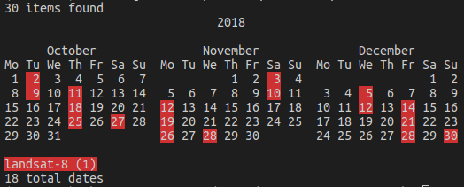

# sat-search

[](https://circleci.com/gh/sat-utils/sat-search)

Sat-search is a Python 3 library and a command line tool for discovering and downloading publicly available satellite imagery using a conformant API such as [sat-api](https://github.com/sat-utils/sat-api).


## Installation

Sat-search is a very lightweight application, with the only dependency being [sat-stac](https://github.com/sat-utils/sat-stac), which in turn has two dependencies: `requests` and `python-dateutil`. To install sat-search from PyPi:

```bash
$ pip install sat-search
```

From source repository:

```bash
$ git clone https://github.com/sat-utils/sat-search.git
$ cd sat-search
$ pip install .
```

#### Versions
The latest version of sat-search is 0.2.2, which uses [STAC v0.7.0](https://github.com/radiantearth/stac-spec/tree/v0.7.0). To install other versions of sat-search, specify the version in the call to pip. 

```bash
pip install sat-search==0.2.0
```

The table below shows the corresponding versions between sat-search and STAC. Additional information can be found in the [CHANGELOG](CHANGELOG.md)

| sat-search | STAC  |
| --------   | ----  |
| 0.1.x      | 0.5.x - 0.6.x |
| 0.2.x      | 0.5.x - 0.7.x |
| 0.3.x      | 0.9.x |


## Using sat-search

With sat-search you can search a STAC compliant API with full querying support (if supported by the API). Search results can be saved as a GeoJSON file then loaded later. Assets can be downloaded by the asset key, or "color" (common_name of the band) if provided.

Sat-search is a Python 3 library that can incorporated into other applications. A [Jupyter notebook tutorial](tutorial-1.ipynb) is included that covers all the main features of the library.

Sat-search also comes with a Command Line Interface (CLI), which is explained more below.

#### The CLI
The sat-search CLI has an extensive online help that can be printed with the `-h` switch.

```
$ sat-search -h
usage: sat-search [-h] {search,load} ...

sat-search (v0.2.0)

positional arguments:
  {search,load}
    search       Perform new search of items
    load         Load items from previous search

optional arguments:
  -h, --help     show this help message and exit
```

As can be seen there are two subcommands, `search` and `load`, each of which has it's own help.

#### `search`

```
$ sat-search search -h
usage: sat-search search [-h] [--version] [-v VERBOSITY]
                         [--print-md [PRINTMD [PRINTMD ...]]] [--print-cal]
                         [--save SAVE] [-c COLLECTION] [--ids [IDS [IDS ...]]]
                         [--bbox BBOX BBOX BBOX BBOX]
                         [--intersects INTERSECTS] [--datetime DATETIME]
                         [--sort [SORT [SORT ...]]] [--found]
                         [-p [PROPERTY [PROPERTY ...]]] [--url URL]

optional arguments:
  -h, --help            show this help message and exit
  --version             Print version and exit
  -v VERBOSITY, --verbosity VERBOSITY
                        0:quiet, 1:error, 2:warning, 3:info, 4:debug (default: 2)

output options:
  --print-md [PRINTMD [PRINTMD ...]]
                        Print specified metadata for matched scenes (default: None)
  --print-cal           Print calendar showing dates (default: False)
  --save SAVE           Save results as GeoJSON (default: None)

search options:
  -c COLLECTION, --collection COLLECTION
                        Name of collection (default: None)
  --ids [IDS [IDS ...]]
                        One or more scene IDs from provided collection
                        (ignores other parameters) (default: None)
  --bbox BBOX BBOX BBOX BBOX
                        Bounding box (min lon, min lat, max lon, max lat)
                        (default: None)
  --intersects INTERSECTS
                        GeoJSON Feature (file or string) (default: None)
  --datetime DATETIME   Single date/time or begin and end date/time (e.g.,
                        2017-01-01/2017-02-15) (default: None)
  --sort [SORT [SORT ...]]
                        Sort by fields (default: None)
  --found               Only output how many Items found (default: False)
  -p [PROPERTY [PROPERTY ...]], --property [PROPERTY [PROPERTY ...]]
                        Properties of form KEY=VALUE (<, >, <=, >=, =
                        supported) (default: None)
  --url URL             URL of the API (default: https://n34f767n91.execute-
                        api.us-east-1.amazonaws.com/prod)
```

**Search options**

- **collection** - Search only a specific collection. This is a shortcut, collection can also be provided as a property (e.g., `-p "collection=landsat-8-l1"`)
- **ids** - Fetch the Item for the provided IDs in the given collection (collection must be provided). All other search options will be ignored.
- **intersects** - Provide a GeoJSON Feature string or the name of a GeoJSON file containing a single Feature that is a Polygon of an AOI to be searched.
- **datetime** - Provide a single partial or full datetime (e.g., 2017, 2017-10, 2017-10-11, 2017-10-11T12:00), or two seperated by a slash that defines a range. e.g., 2017-01-01/2017-06-30 will search for scenes acquired in the first 6 months of 2017.
- **property** - Allows searching for any other scene properties by providing the pair as a string (e.g. `-p "landsat:row=42"`, `-p "eo:cloud_cover<10"`). Supported symbols include: =, <, >, >=, and <=
- **sort** - Sort by specific properties in ascending or descending order. A list of properties can be provided which will be used for sorting in that order of preference. By default a property will be sorted in descending order. To specify the order the property can be preceded with '<' (ascending) or '>' (descending). e.g., `--sort ">datetime" "<eo:cloud_cover" will sort by descending date, then by ascending cloud cover
- **found** - This will print out the total number of scenes found, then exit without fetching the actual items. 
- **url** - The URL endpoint of a STAC compliant API, this can also be set with the environment variable SATUTILS_API_URL

**Output options**
These options control what to do with the search results, multiple switches can be provided.

- **print-md** - Prints a list of specific metadata fields for all the scenes. If given without any arguments it will print a list of the dates and scene IDs. Otherwise it will print a list of fields that are provided. (e.g., --print-md date eo:cloud_cover eo:platform will print a list of date, cloud cover, and the satellite platform such as WORLDVIEW03)
- **print-cal** - Prints a text calendar (see iumage below) with specific days colored depending on the platform of the scene (e.g. landsat-8), along with a legend.
- **save** - Saves results as a FeatureCollection. The FeatureCollection 'properties' contains all of the arguments used in the search and the 'features' contain all of the individual scenes, with individual scene metadata merged with collection level metadata (metadata fields that are the same across all one collection, such as eo:platform)




#### `load`

Scenes that were previously saved with `sat-search search --save ...` can be loaded with the `load` subcommand.

```
$ sat-search load -h
usage: sat-search load [-h] [--version] [-v VERBOSITY]
                       [--print-md [PRINTMD [PRINTMD ...]]] [--print-cal]
                       [--save SAVE] [--datadir DATADIR] [--filename FILENAME]
                       [--download [DOWNLOAD [DOWNLOAD ...]]]
                       items

positional arguments:
  items                 GeoJSON file of Items

optional arguments:
  -h, --help            show this help message and exit
  --version             Print version and exit
  -v VERBOSITY, --verbosity VERBOSITY
                        0:quiet, 1:error, 2:warning, 3:info, 4:debug (default:
                        2)

output options:
  --print-md [PRINTMD [PRINTMD ...]]
                        Print specified metadata for matched scenes (default:
                        None)
  --print-cal           Print calendar showing dates (default: False)
  --save SAVE           Save results as GeoJSON (default: None)

download options:
  --datadir DATADIR     Directory pattern to save assets (default:
                        ./${eo:platform}/${date})
  --filename FILENAME   Save assets with this filename pattern based on
                        metadata keys (default: ${id})
  --download [DOWNLOAD [DOWNLOAD ...]]
                        Download assets (default: None)
```

Note that while the search options are gone, output options are still available and can be used with the search results loaded from the file. There is also a new series of options for downloading data.

#### Downloading assets
When loading results from a file, the user now has the option to download assets from the scenes.

**Download options**
These control the downloading of assets. Both datadir and filename can include metadata patterns that will be substituted per scene.
- **datadir** - This specifies where downloaded assets will be saved to. It can also be specified by setting the environment variable SATUTILS_DATADIR.
- **filename** - The name of the file to save. It can also be set by setting the environment variable SATUTILS_FILENAME
- **download** - Provide a list of keys to download these assets. More information on downloading data is provided below.

**Metadata patterns**
Metadata patterns can be used in **datadir** and **filename** in order to have custom path and filenames based on the Item metadata. For instance specifying datadir as "./${eo:platform}/${date}" will save assets for each Item under directories of the platform and the date. So a landsat-8 Item from June 20, 2018 will have it's assets saved in a directory './landsat-8/2017-06-20'. For filenames these work exactly the same way, except the filename will contain a suffix containing the asset key and the appropriate extension.

```
    sat-search load scenes.json --download thumbnail MTL
```

In this case the defaults for `datadir` ("./${eo:platform}/${date}") and `filename` ("${id}") are used so the download files are saved like this:

```
landsat-8/
└── 2018-10-02
    ├── LC80090292018275LGN00_MTL.txt
    ├── LC80090292018275LGN00_thumbnail.jpg
    ├── LC80090302018275LGN00_MTL.txt
    └── LC80090302018275LGN00_thumbnail.jpg
```

A shortcut to download all of the assets is available by providing "ALL" as the key to download. This will download every asset for every item.

```
   sat-search load scenes.json --download ALL
```

## Tutorial
This [Jupyter notebook tutorial](tutorial-1.ipynb) covers all the main features of the library.

## About
sat-search was created by [Development Seed](<http://developmentseed.org>) and is part of a collection of tools called [sat-utils](https://github.com/sat-utils).
